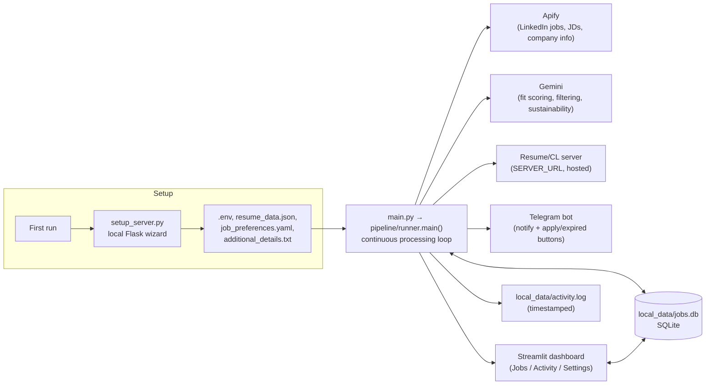
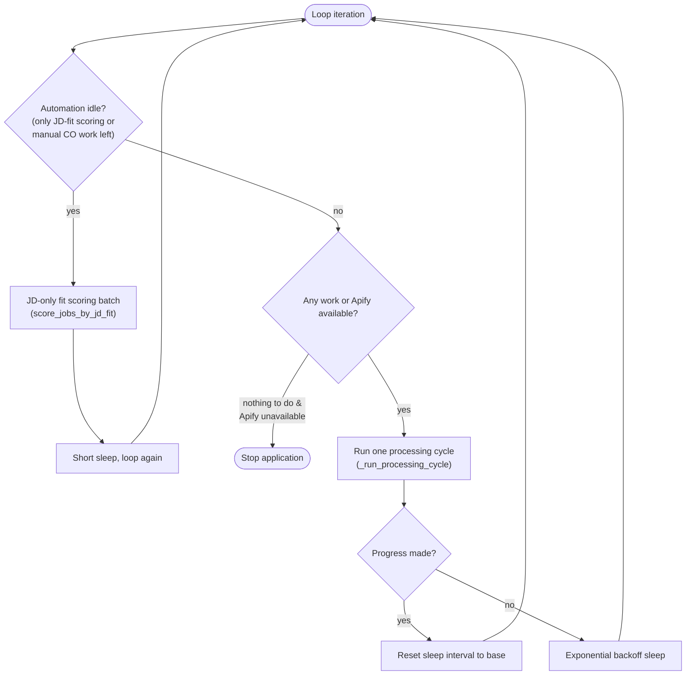
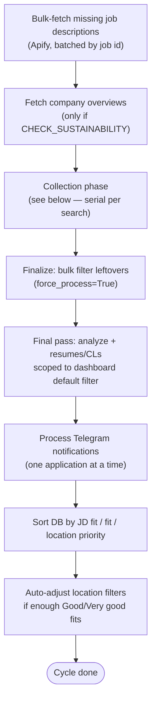
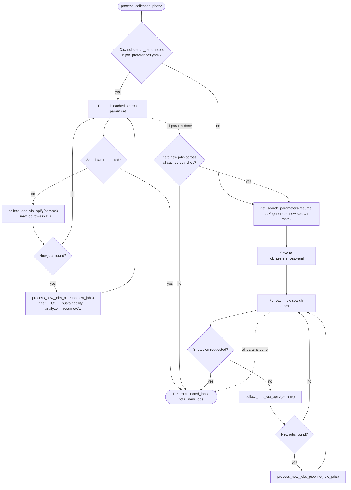
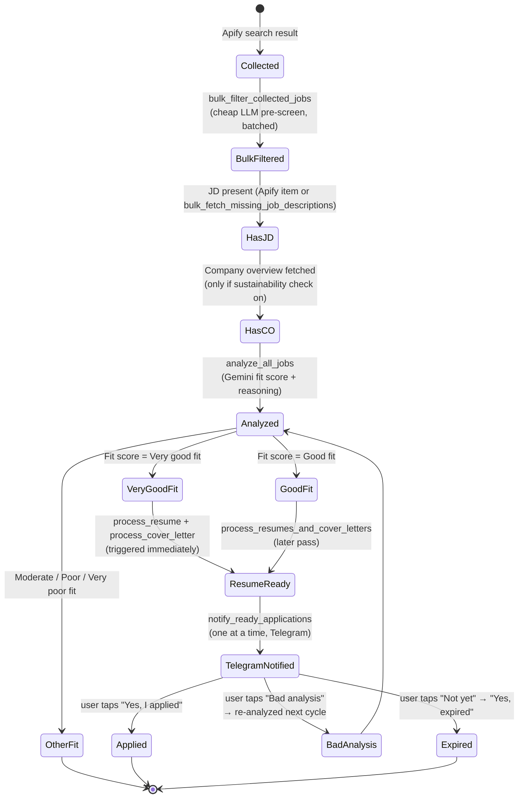
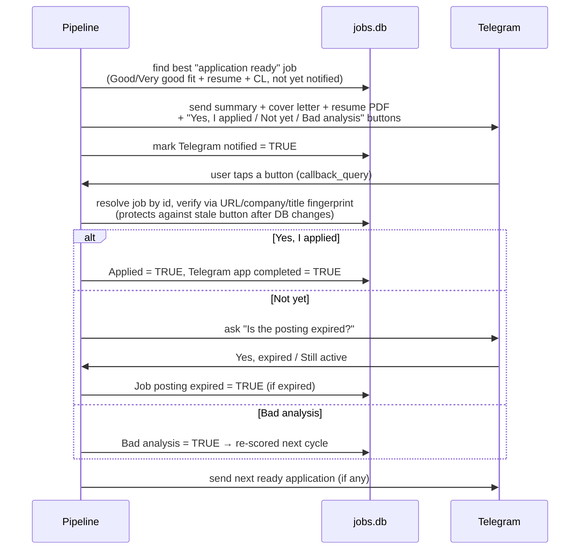

# How the pipeline works

This document describes the runtime workflow of the job application preprocessor: how jobs move
from "found on LinkedIn via Apify" to "tailored resume + cover letter delivered on Telegram."

For setup instructions see [`setup_guide.md`](setup_guide.md). For planned/future work see
[`BACKLOG.md`](BACKLOG.md).

## System overview

## The main loop

`pipeline/runner.main()` runs forever until shutdown is requested (`Ctrl+C` / `SIGTERM`). Each
pass through the loop is a **processing cycle**. Between cycles it sleeps (with exponential
backoff when nothing changed) unless there's known pending work.

## One processing cycle

## Collection phase — serial per-search draining

**This is the important part for anyone changing collection behavior.** For each search query,
the pipeline collects that search's jobs from Apify and then **immediately drains the full
downstream pipeline for just those jobs** — bulk filter, company overview, sustainability check,
fit analysis, resume/cover-letter generation — before moving on to the next search query.

This means:

- A crash or shutdown mid-cycle only loses at most one search's worth of unprocessed jobs, not
  the whole cycle's collected backlog.
- Good/Very good fit jobs (and their resumes) show up sooner instead of waiting for every search
  in the cycle to finish first.
- If `job_preferences.yaml` has no cached search parameters yet — or the cached ones found zero
  new jobs — the LLM regenerates search parameters, and the same drain-per-search loop runs
  again for the new list.

Implementation: `pipeline/collection.py` (`process_collection_phase`, `_run_search_and_drain`,
`process_new_jobs_pipeline`). Tests: `tests/test_collection_serial.py`.

## Job lifecycle (single job's state machine)

Every job is a row in `local_data/jobs.db` (`local_storage.JobDatabase`). Columns act as a state
machine — most pipeline steps are "find rows missing X, fill it in."

Key columns: `Bulk filtered`, `Job Description`, `Company overview`, `Fit score`,
`Fit score enum`, `Tailored resume url`, `Tailored cover letter (to be humanized)`,
`Telegram notified`, `Telegram app completed`, `Applied`, `Job posting expired`, `Bad analysis`.

## Telegram notifications (one application at a time)

To avoid overwhelming the user, only one "ready to apply" job is pushed to Telegram at a time.
The next one is sent only after the current one is resolved (applied / bad analysis / expired).

## Where to look in the code

| Concern | File |
|---|---|
| Main loop, sleep/backoff, shutdown | `pipeline/runner.py` |
| Collection + serial per-search draining | `pipeline/collection.py` |
| Bulk LLM filter, JD/CO Apify fetch | `pipeline/bulk_ops.py` |
| Fit analysis (Gemini) | `pipeline/analysis.py` |
| JD-only fit scoring (idle-time fallback) | `pipeline/jd_fit_scoring.py` |
| Resume / cover letter generation | `pipeline/resumes.py`, `api_methods.py` |
| Telegram bot + notifications | `utils/telegram_bot.py`, `pipeline/telegram_notify.py` |
| Job storage (SQLite) | `local_storage.py` |
| Dashboard (Jobs / Activity / Settings) | `dashboard/` |
| Rate limiting (Gemini) | `utils/gemini_throttle.py` (unlimited by default) |
